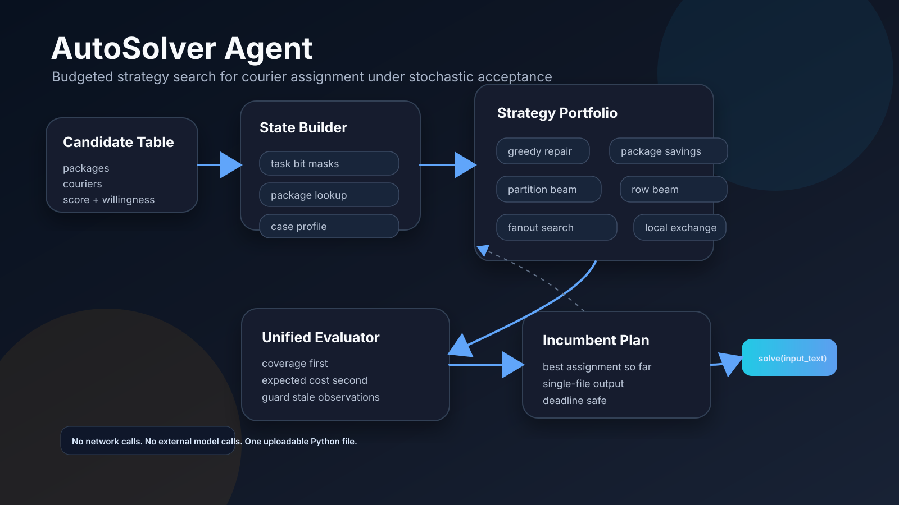
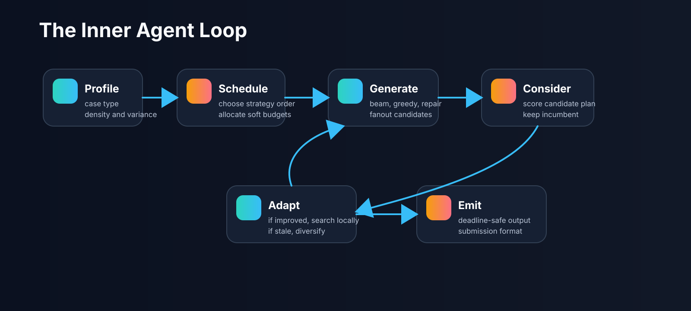
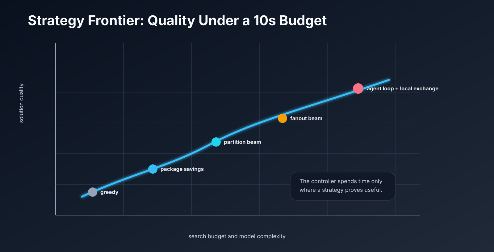

# AutoSolver Agent

**A budgeted strategy-search agent for stochastic courier assignment.**

AutoSolver Agent is a single-file optimization system for delivery task assignment. It treats each test case as a short-horizon search problem: parse the candidate table, build multiple assignment hypotheses, evaluate them with a unified objective, and keep improving until the time budget expires.

The project is designed for hackathon-style judging where the final upload surface is only `solver.py`, while the development workflow still needs experiments, tests, diagrams, and reproducible evaluation.



## What It Solves

Given candidate rows of:

```text
task_id_list    courier_id    total_score    willingness
```

the solver returns:

```python
[(task_id_list_str, [courier_id, ...]), ...]
```

The objective is lexicographic:

1. Maximize covered delivery tasks.
2. Minimize expected system cost.
3. Respect task conflicts, courier conflicts, bundled packages, and optional multi-courier fanout.

## Core Idea

The submitted solver is not a one-shot heuristic. It is a compact offline agent:

- **State builder**: indexes tasks, couriers, candidate packages, conflict masks, and package lookups.
- **Strategy portfolio**: greedy, package savings, partition beam, row beam, min-cost style reassignment, randomized greedy, and local exchange.
- **Budget controller**: routes cases by observable structure such as scarcity, low willingness, feature variance, and task scale.
- **Unified evaluator**: every candidate plan goes through the same coverage and cost comparator.
- **Adaptive loop**: strategies that improve the incumbent get follow-up local search; stale or unsafe anchors are guarded by current-input scoring.



## Repository Layout

```text
.
|-- solver.py                    # Single-file contest submission
|-- autosolver/
|   |-- local_judge.py            # Local legality and proxy-score checker
|-- tests/
|   |-- test_solver_synthetic.py  # Synthetic regression tests
|-- examples/
|   |-- tiny_case.tsv             # Small runnable example
|-- docs/
|   |-- method.md                 # Paper-style method description
|   |-- experiment_protocol.md    # How experiments are run and filtered
|   |-- submission_guide.md       # How to package the solver safely
|-- assets/
|   |-- autosolver_architecture.svg
|   |-- agent_loop.svg
|   |-- strategy_frontier.svg
```

## Quick Start

```powershell
python -m py_compile solver.py
python autosolver\local_judge.py --solver solver.py --case examples\tiny_case.tsv --time-limit 1.0
python tests\test_solver_synthetic.py
```

For contest upload, submit only:

```text
solver.py
```

No third-party packages are required.

## Method Snapshot

AutoSolver searches over package-level assignment plans under a strict wall-clock budget.

| Component | Role |
|---|---|
| Feature router | Selects scarce, low-willingness, tiny, small, or general case path |
| Expected fanout beam | Builds package rows with primary and backup couriers |
| Partition beam | Enumerates task partitions into singleton/bundled packages |
| Reassignment | Re-selects couriers for a fixed package partition |
| Local exchange | Performs 1-opt, pair recombination, and ejection repair |
| Guarded anchors | Uses historical structures only when current-input scoring validates them |

See [docs/method.md](docs/method.md) for the full method write-up.

## Design Principles

- **Offline only**: no network calls, no online LLM calls, no persistent state.
- **Submission-safe**: the solver is self-contained and importable by a judge.
- **Agentic, not magical**: the system improves by explicit search, scoring, and strategy scheduling.
- **Risk-aware**: hardcoded observations are never trusted unless the current input validates them.
- **Small enough to upload**: the current solver is below the contest single-file limit.

## Results and Evaluation

The public local judge checks validity, coverage, runtime, and a proxy score. Official hidden judging can differ, especially for multi-courier fanout and willingness effects, so the experiment protocol separates:

- local legality tests,
- synthetic edge-case regression,
- platform batch result analysis,
- guarded retention of only stable improvements.



## Citation

If you reference this project, cite it as:

```bibtex
@software{autosolver_agent_2026,
  title = {AutoSolver Agent: Budgeted Strategy Search for Courier Assignment},
  author = {Ansel},
  year = {2026},
  url = {https://github.com/crystallatsyrc/AutoSolver-Agent}
}
```

## License

MIT License. See [LICENSE](LICENSE).
